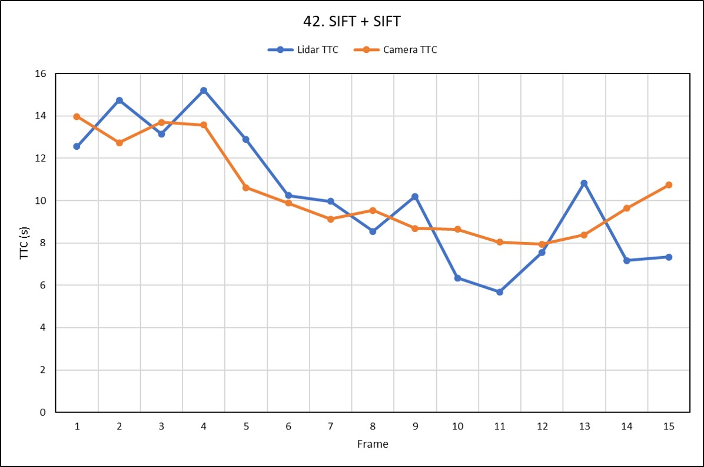

# SFND 3D Object Tracking

Welcome to the final project of the camera course. By completing all the lessons, you now have a solid understanding of keypoint detectors, descriptors, and methods to match them between successive images. Also, you know how to detect objects in an image using the YOLO deep-learning framework. And finally, you know how to associate regions in a camera image with Lidar points in 3D space. Let's take a look at our program schematic to see what we already have accomplished and what's still missing.

In this final project, you will implement the missing parts in the schematic. To do this, you will complete four major tasks:
1. First, you will develop a way to match 3D objects over time by using keypoint correspondences.
2. Second, you will compute the TTC based on Lidar measurements.
3. You will then proceed to do the same using the camera, which requires to first associate keypoint matches to regions of interest and then to compute the TTC based on those matches.
4. And lastly, you will conduct various tests with the framework. Your goal is to identify the most suitable detector/descriptor combination for TTC estimation and also to search for problems that can lead to faulty measurements by the camera or Lidar sensor. In the last course of this Nanodegree, you will learn about the Kalman filter, which is a great way to combine the two independent TTC measurements into an improved version which is much more reliable than a single sensor alone can be. But before we think about such things, let us focus on your final project in the camera course.

## Dependencies for Running Locally
* cmake >= 2.8
  * All OSes: [click here for installation instructions](https://cmake.org/install/)
* make >= 4.1 (Linux, Mac), 3.81 (Windows)
  * Linux: make is installed by default on most Linux distros
  * Mac: [install Xcode command line tools to get make](https://developer.apple.com/xcode/features/)
  * Windows: [Click here for installation instructions](http://gnuwin32.sourceforge.net/packages/make.htm)
* Git LFS
  * Weight files are handled using [LFS](https://git-lfs.github.com/)
* OpenCV >= 4.1
  * This must be compiled from source using the `-D OPENCV_ENABLE_NONFREE=ON` cmake flag for testing the SIFT and SURF detectors.
  * The OpenCV 4.1.0 source code can be found [here](https://github.com/opencv/opencv/tree/4.1.0)
* gcc/g++ >= 5.4
  * Linux: gcc / g++ is installed by default on most Linux distros
  * Mac: same deal as make - [install Xcode command line tools](https://developer.apple.com/xcode/features/)
  * Windows: recommend using [MinGW](http://www.mingw.org/)

## Basic Build Instructions

1. Clone this repo.
2. Make a build directory in the top level project directory: `mkdir build && cd build`
3. Compile: `cmake .. && make`
4. Run it: `./3D_object_tracking`.

Or else you can also use following commands -
1. `./clean.sh` to clean the project.
2. `./build.sh` to build the project.
3. `./run.sh` to run the project.

# Rubric

## Match 3D Objects
Implement the method `matchBoundingBoxes`, which takes as input both the previous and the current data frames and provides as output the ids of the matched regions of interest (i.e. the boxID property). Matches must be the ones with the highest number of keypoint correspondences.

## Compute Lidar Based TTC
Compute the time-to-collision in second for all matched 3D objects using only Lidar measurements from the matched bounding boxes between current and previous frame.

## Associate Keypoint Correspondences with Bounding Boxes
Prepare the TTC computation based on camera measurements by associating keypoint correspondences to the bounding boxes which enclose them. All matches which satisfy this condition must be added to a vector in the respective bounding box.

## Compute Camera-based TTC
Compute the time-to-collision in second for all matched 3D objects using only keypoint correspondences from the matched bounding boxes between current and previous frame.

## Performance Evaluation 1
Find examples where the TTC estimate of the Lidar sensor does not seem plausible. Describe your observations and provide a sound argumentation why you think this happened.

>Several examples (2-3) have been identified and described in detail. The assertion that the TTC is off has been based on manually estimating the distance to the rear of the preceding vehicle from a top view perspective of the Lidar points.

Consider the following examples -
1. Implausible value - Infinity and or negative TTC

*SHITOMASI + BRISK*

| Frame | 0 | 1 | 2 | 3 | 4 | 5 | 6 | 7 | 8 | 9 | 10 | 11 | 12 | 13 | 14 | 15 | 16 | 17 | 18 | 19 | 20 | 21 | 22 | 23 | 24 | 25 | 26 | 27 | 28 | 29 | 30 | 31 | 32 | 33 | 34 | 35 | 36 | 37 | 38 | 39 | 40 | 41 | 42 |
|:----:|:----:|:----:|:----:|:----:|:----:|:----:|:----:|:----:|:----:|:----:|:----:|:----:|:----:|:----:|:----:|:----:|:----:|:----:|:----:|:----:|:----:|:----:|:----:|:----:|:----:|:----:|:----:|:----:|:----:|:----:|:----:|:----:|:----:|:----:|:----:|:----:|:----:|:----:|:----:|:----:|:----:|:----:|:----:|
| Lidar TTC | 12.56 | 14.75 | 13.15 | 15.21 | 12.89 | 10.24 | 9.97 | 8.55 | 10.20 | 6.34 | 5.69 | 7.56 | 10.83 | 7.17 | 7.34 | 10.63 | 8.29 | 8.09 | 7.33 | 4.47 | 5.48 | 17.85 | 5.86 | 10.76 | 12.69 | 13.45 | -296.09 | inf | -111.23 | 296.42 | -444.83 | 296.35 | 222.04 | -127.09 | inf | 126.89 | inf | -127.09 | inf | 126.89 | inf | -74.22 | inf |
| Camera TTC | 12.79 | 16.62 | 14.27 | 17.23 | 15.17 | 10.35 | 9.78 | 10.73 | 8.55 | 8.86 | 7.86 | 7.77 | 7.81 | 9.82 | 9.71 | 10.00 | 10.94 | 8.88 | 7.61 | 6.38 | 6.77 | 7.38 | 8.14 | 9.73 | 13.62 | 24.50 | -inf | -inf | -inf | -inf | -inf | -inf | -inf | -inf | -16.25 | -inf | -48.09 | -inf | -92.91 | -inf | -inf | -inf | -inf |

We can see that at around frame 35 i.e. (35\*imgStepWidth = 35\*2 = 70 image no.) the lidar TTC goes to -ve and infinity after that, this is due to the fact that we can see from the images that the car has come to a stop.

2. Implausible value

*SHITOMASI + BRISK*

| Frame | 0 | 1 | 2 | 3 | 4 | 5 | 6 | 7 | 8 | 9 | 10 | 11 | 12 | 13 | 14 |
|:----:|:----:|:----:|:----:|:----:|:----:|:----:|:----:|:----:|:----:|:----:|:----:|:----:|:----:|:----:|:----:|
| Lidar TTC | 12.56 | 14.75 | 13.15 | 15.21 | 12.89 | 10.24 | 9.97 | 8.55 | 10.20 | 6.34 | 5.69 | 7.56 | 10.83 | 7.17 | 7.34 |
| Camera TTC | 12.79 | 16.62 | 14.27 | 17.23 | 15.17 | 10.35 | 9.78 | 10.73 | 8.55 | 8.86 | 7.86 | 7.77 | 7.81 | 9.82 | 9.71 |

In the above figure between frame 3 and 4 we can see that the TTC increases indicating that there is still some noise and or outliers in the lidar data. I have implemented [Euclidean Clustering](http://pointclouds.org/documentation/tutorials/cluster_extraction.php) with `float clusterTolerance = 0.05;` and `ec.setMinClusterSize(50);`. This noise maybe due to -
- Improper calibration and or mounting of the lidar.
- Lidar and camera not perfectly synchornized.
- The ground is not flat (pothole, speedbump, slope etc.), so we need to account for changes in the ground height.

This error occurs due to that fact that we consider only one closest point on the rear bumper of the vehicle for calculating TTC.

The ways in which it can be improved is -
- Fuse lidar data with radar data and use Kalman Filter for tracking using which we can calculate TTC.
- Compensation in the calculation for the uneveness of the road surface.
- Instead of just using 1 point to calculate TTC we can implement [DBSCAN clustering](https://en.wikipedia.org/wiki/DBSCAN) algorithm, and take all non-core (edge) points from the largest cluster as input to calculate TTC.

## Performance Evaluation 2
Run several detector / descriptor combinations and look at the differences in TTC estimation. Find out which methods perform best and also include several examples where camera-based TTC estimation is way off. As with Lidar, describe your observations again and also look into potential reasons.

>All detector / descriptor combinations implemented in previous chapters have been compared with regard to the TTC estimate on a frame-by-frame basis. To facilitate comparison, a spreadsheet and graph should be used to represent the different TTCs.

I have created bash script `loopingCombination.sh` which loops through all the possible combination of detector and descriptor pairs.

Run it: `./loopingCombination.sh`.

This creates a `output/output.md` file.

I used KNN match selection (k=2) and performed descriptor distance ratio filtering with t=0.8 in file `matching2D.cpp`

I have already [benchmarked](https://github.com/gpokhark/SFND_2D_Feature_Matching) the efficiency of the various combination of detector and descriptor pair. The top 3 detector/ descriptor pairs are as follows:

|Sr. No. | Detector + Descriptor |Total Keypoints |Total Matches |Total Time (ms) |Ratio (matches/time) |
|:---:|:---:|:----:|:-----:|:-----:|:-----:|
|1 | FAST + ORB |17874 |4254 |20.8537 |203.993 |
|2 | FAST + BRIEF |17874 |4904 |28.2515 |173.584 |
|3 | FAST + BRISK |17874 |3170 |65.9564 |48.0621 |

Comparison plots for TTC using lidar and camera using various combination of detector descriptor pairs can has been plotted here [benchmark plots](./output.md).

From the plots it can be seen that the TTC calculated from camera is off from the TTC calculated from lidar, due to couple of following reasons -

- Keypoints mis-matching between two frames.
- Few of the detector despricptors pairs are highly sensitive to scale and contrast change. This causes the distance ratio tend to 1, which makes it appear as though both the vehicles are static. Due to which we get large value for TTC.

Ways in which it can be imporved - 

- Use detector/descriptor combination which is insensitve to scale, rotation and contrast.
- Compare multipe frames.
- Fuse the data from lidar, camera and radar using Kalman Filter to minimize the covariance and to accurately measure the distance.

It can be seen from the plots that following detector descriptor combination provides better TTC estimate closer to that of lidar -

