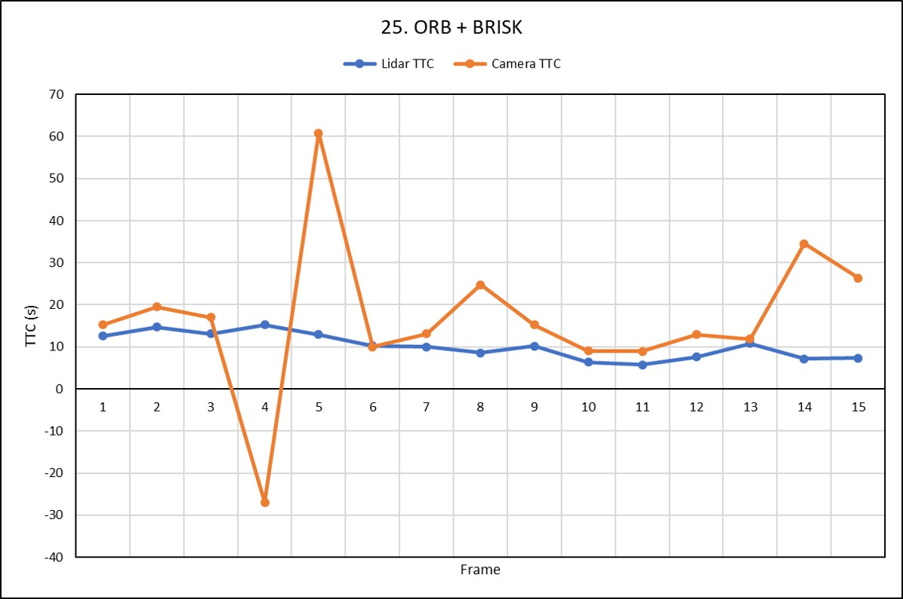

# BENCHMARK PLOTS

## 1. SHITOMASI + BRISK
| Frame | 0 | 1 | 2 | 3 | 4 | 5 | 6 | 7 | 8 | 9 | 10 | 11 | 12 | 13 | 14 |
|:----:|:----:|:----:|:----:|:----:|:----:|:----:|:----:|:----:|:----:|:----:|:----:|:----:|:----:|:----:|:----:|
| Lidar TTC | 12.56 | 14.75 | 13.15 | 15.21 | 12.89 | 10.24 | 9.97 | 8.55 | 10.20 | 6.34 | 5.69 | 7.56 | 10.83 | 7.17 | 7.34 |
| Camera TTC | 12.79 | 16.62 | 14.27 | 17.23 | 15.17 | 10.35 | 9.78 | 10.73 | 8.55 | 8.86 | 7.86 | 7.77 | 7.81 | 9.82 | 9.71 |

## 2. SHITOMASI + BRIEF
| Frame | 0 | 1 | 2 | 3 | 4 | 5 | 6 | 7 | 8 | 9 | 10 | 11 | 12 | 13 | 14 |
|:----:|:----:|:----:|:----:|:----:|:----:|:----:|:----:|:----:|:----:|:----:|:----:|:----:|:----:|:----:|:----:|
| Lidar TTC | 12.56 | 14.75 | 13.15 | 15.21 | 12.89 | 10.24 | 9.97 | 8.55 | 10.20 | 6.34 | 5.69 | 7.56 | 10.83 | 7.17 | 7.34 |
| Camera TTC | 12.96 | 14.00 | 14.47 | 18.85 | 14.10 | 10.49 | 12.95 | 10.73 | 10.11 | 8.88 | 10.66 | 7.83 | 8.53 | 9.54 | 11.38 |

## 3. SHITOMASI + ORB
| Frame | 0 | 1 | 2 | 3 | 4 | 5 | 6 | 7 | 8 | 9 | 10 | 11 | 12 | 13 | 14 |
|:----:|:----:|:----:|:----:|:----:|:----:|:----:|:----:|:----:|:----:|:----:|:----:|:----:|:----:|:----:|:----:|
| Lidar TTC | 12.56 | 14.75 | 13.15 | 15.21 | 12.89 | 10.24 | 9.97 | 8.55 | 10.20 | 6.34 | 5.69 | 7.56 | 10.83 | 7.17 | 7.34 |
| Camera TTC | 17.95 | 18.82 | 12.89 | 15.18 | 13.31 | 10.16 | 10.68 | 12.52 | 7.48 | 9.92 | 8.00 | 7.78 | 8.29 | 11.42 | 10.98 |

## 4. SHITOMASI + FREAK
| Frame | 0 | 1 | 2 | 3 | 4 | 5 | 6 | 7 | 8 | 9 | 10 | 11 | 12 | 13 | 14 |
|:----:|:----:|:----:|:----:|:----:|:----:|:----:|:----:|:----:|:----:|:----:|:----:|:----:|:----:|:----:|:----:|
| Lidar TTC | 12.56 | 14.75 | 13.15 | 15.21 | 12.89 | 10.24 | 9.97 | 8.55 | 10.20 | 6.34 | 5.69 | 7.56 | 10.83 | 7.17 | 7.34 |
| Camera TTC | 13.76 | 13.12 | 13.01 | 13.57 | 16.17 | 10.23 | 9.86 | 10.66 | 7.87 | 8.35 | 7.86 | 8.90 | 7.87 | 10.01 | 10.26 |

## 5. SHITOMASI + AKAZE

terminate called after throwing an instance of 'cv::Exception'
  what():  OpenCV(4.1.1) /home/gaurav/Other_Drive/Udacity/Practice_Sensor_Fusion/3_Camera/opencv-4.1.1/modules/features2d/src/kaze/AKAZEFeatures.cpp:1192: error: (-215:Assertion failed) 0 <= kpts[i].class_id && kpts[i].class_id < static_cast<int>(evolution_.size()) in function 'Compute_Descriptors'

./run.sh: line 8:  8274 Aborted                 (core dumped) ./3D_object_tracking

## 6. SHITOMASI + SIFT
| Frame | 0 | 1 | 2 | 3 | 4 | 5 | 6 | 7 | 8 | 9 | 10 | 11 | 12 | 13 | 14 |
|:----:|:----:|:----:|:----:|:----:|:----:|:----:|:----:|:----:|:----:|:----:|:----:|:----:|:----:|:----:|:----:|
| Lidar TTC | 12.56 | 14.75 | 13.15 | 15.21 | 12.89 | 10.24 | 9.97 | 8.55 | 10.20 | 6.34 | 5.69 | 7.56 | 10.83 | 7.17 | 7.34 |
| Camera TTC | 20.74 | 14.30 | 12.43 | 13.28 | 14.44 | 12.41 | 9.80 | 13.33 | 9.44 | 10.19 | 10.44 | 8.97 | 8.54 | 13.39 | 12.09 |

## 7. HARRIS + BRISK
| Frame | 0 | 1 | 2 | 3 | 4 | 5 | 6 | 7 | 8 | 9 | 10 | 11 | 12 | 13 | 14 |
|:----:|:----:|:----:|:----:|:----:|:----:|:----:|:----:|:----:|:----:|:----:|:----:|:----:|:----:|:----:|:----:|
| Lidar TTC | 12.56 | 14.75 | 13.15 | 15.21 | 12.89 | 10.24 | 9.97 | 8.55 | 10.20 | 6.34 | 5.69 | 7.56 | 10.83 | 7.17 | 7.34 |
| Camera TTC | 15.42 | 22.05 | 25.68 | 16.90 | 7.32 | nan | nan | 12.77 | nan | nan | nan | nan | 6.03 | 14.38 | -509.45 |

## 8. HARRIS + BRIEF

HARRIS + BRIEF
| Frame | 0 | 1 | 2 | 3 | 4 | 5 | 6 | 7 | 8 | 9 | 10 | 11 | 12 | 13 | 14 |
|:----:|:----:|:----:|:----:|:----:|:----:|:----:|:----:|:----:|:----:|:----:|:----:|:----:|:----:|:----:|:----:|
| Lidar TTC | 12.56 | 14.75 | 13.15 | 15.21 | 12.89 | 10.24 | 9.97 | 8.55 | 10.20 | 6.34 | 5.69 | 7.56 | 10.83 | 7.17 | 7.34 |
| Camera TTC | 20.42 | 22.05 | 25.71 | 16.90 | nan | nan | nan | 16.91 | nan | nan | nan | nan | nan | 90.59 | -35.14 |

## 9. HARRIS + ORB
| Frame | 0 | 1 | 2 | 3 | 4 | 5 | 6 | 7 | 8 | 9 | 10 | 11 | 12 | 13 | 14 |
|:----:|:----:|:----:|:----:|:----:|:----:|:----:|:----:|:----:|:----:|:----:|:----:|:----:|:----:|:----:|:----:|
| Lidar TTC | 12.56 | 14.75 | 13.15 | 15.21 | 12.89 | 10.24 | 9.97 | 8.55 | 10.20 | 6.34 | 5.69 | 7.56 | 10.83 | 7.17 | 7.34 |
| Camera TTC | 20.42 | 22.05 | 25.71 | 16.90 | nan | nan | nan | 16.91 | nan | nan | nan | nan | nan | 14.38 | -1018.89 |

## 10. HARRIS + FREAK
| Frame | 0 | 1 | 2 | 3 | 4 | 5 | 6 | 7 | 8 | 9 | 10 | 11 | 12 | 13 | 14 |
|:----:|:----:|:----:|:----:|:----:|:----:|:----:|:----:|:----:|:----:|:----:|:----:|:----:|:----:|:----:|:----:|
| Lidar TTC | 12.56 | 14.75 | 13.15 | 15.21 | 12.89 | 10.24 | 9.97 | 8.55 | 10.20 | 6.34 | 5.69 | 7.56 | 10.83 | 7.17 | 7.34 |
| Camera TTC | 20.42 | 22.05 | 23.54 | 51.98 | nan | nan | nan | nan | nan | nan | nan | 5.91 | 6.03 | 14.38 | -83.10 |

## 11. HARRIS + AKAZE

terminate called after throwing an instance of 'cv::Exception'
  what():  OpenCV(4.1.1) /home/gaurav/Other_Drive/Udacity/Practice_Sensor_Fusion/3_Camera/opencv-4.1.1/modules/features2d/src/kaze/AKAZEFeatures.cpp:1192: error: (-215:Assertion failed) 0 <= kpts[i].class_id && kpts[i].class_id < static_cast<int>(evolution_.size()) in function 'Compute_Descriptors'

./run.sh: line 8: 10565 Aborted                 (core dumped) ./3D_object_tracking

## 12. HARRIS + SIFT
| Frame | 0 | 1 | 2 | 3 | 4 | 5 | 6 | 7 | 8 | 9 | 10 | 11 | 12 | 13 | 14 |
|:----:|:----:|:----:|:----:|:----:|:----:|:----:|:----:|:----:|:----:|:----:|:----:|:----:|:----:|:----:|:----:|
| Lidar TTC | 12.56 | 14.75 | 13.15 | 15.21 | 12.89 | 10.24 | 9.97 | 8.55 | 10.20 | 6.34 | 5.69 | 7.56 | 10.83 | 7.17 | 7.34 |
| Camera TTC | 20.42 | 22.05 | 25.71 | 16.90 | nan | nan | nan | 16.91 | nan | nan | nan | nan | nan | 14.50 | -35.14 |

## 13. FAST + BRISK
| Frame | 0 | 1 | 2 | 3 | 4 | 5 | 6 | 7 | 8 | 9 | 10 | 11 | 12 | 13 | 14 |
|:----:|:----:|:----:|:----:|:----:|:----:|:----:|:----:|:----:|:----:|:----:|:----:|:----:|:----:|:----:|:----:|
| Lidar TTC | 12.56 | 14.75 | 13.15 | 15.21 | 12.89 | 10.24 | 9.97 | 8.55 | 10.20 | 6.34 | 5.69 | 7.56 | 10.83 | 7.17 | 7.34 |
| Camera TTC | 12.17 | 17.86 | 22.58 | 13.52 | 24.24 | 11.92 | 14.18 | 10.03 | 8.76 | 9.63 | 9.66 | 10.13 | 13.46 | 10.52 | 10.69 |

## 14. FAST + BRIEF
| Frame | 0 | 1 | 2 | 3 | 4 | 5 | 6 | 7 | 8 | 9 | 10 | 11 | 12 | 13 | 14 |
|:----:|:----:|:----:|:----:|:----:|:----:|:----:|:----:|:----:|:----:|:----:|:----:|:----:|:----:|:----:|:----:|
| Lidar TTC | 12.56 | 14.75 | 13.15 | 15.21 | 12.89 | 10.24 | 9.97 | 8.55 | 10.20 | 6.34 | 5.69 | 7.56 | 10.83 | 7.17 | 7.34 |
| Camera TTC | 15.65 | 21.62 | 24.34 | 18.82 | 11.68 | 13.41 | 13.55 | 10.65 | 10.07 | 9.53 | 10.50 | 10.49 | 9.93 | 10.96 | 14.20 |

## 15. FAST + ORB
| Frame | 0 | 1 | 2 | 3 | 4 | 5 | 6 | 7 | 8 | 9 | 10 | 11 | 12 | 13 | 14 |
|:----:|:----:|:----:|:----:|:----:|:----:|:----:|:----:|:----:|:----:|:----:|:----:|:----:|:----:|:----:|:----:|
| Lidar TTC | 12.56 | 14.75 | 13.15 | 15.21 | 12.89 | 10.24 | 9.97 | 8.55 | 10.20 | 6.34 | 5.69 | 7.56 | 10.83 | 7.17 | 7.34 |
| Camera TTC | 16.42 | 17.71 | 22.90 | 22.53 | 12.00 | 13.31 | 13.31 | 10.27 | 11.05 | 11.71 | 9.71 | 12.26 | 12.27 | 15.54 | 13.60 |

## 16. FAST + FREAK
| Frame | 0 | 1 | 2 | 3 | 4 | 5 | 6 | 7 | 8 | 9 | 10 | 11 | 12 | 13 | 14 |
|:----:|:----:|:----:|:----:|:----:|:----:|:----:|:----:|:----:|:----:|:----:|:----:|:----:|:----:|:----:|:----:|
| Lidar TTC | 12.56 | 14.75 | 13.15 | 15.21 | 12.89 | 10.24 | 9.97 | 8.55 | 10.20 | 6.34 | 5.69 | 7.56 | 10.83 | 7.17 | 7.34 |
| Camera TTC | 13.09 | 16.53 | 21.86 | 14.38 | 11.10 | 11.74 | 10.91 | 12.03 | 9.18 | 9.63 | 9.55 | 8.37 | 10.10 | 10.42 | 11.26 |

## 17. FAST + AKAZE
terminate called after throwing an instance of 'cv::Exception'
  what():  OpenCV(4.1.1) /home/gaurav/Other_Drive/Udacity/Practice_Sensor_Fusion/3_Camera/opencv-4.1.1/modules/features2d/src/kaze/AKAZEFeatures.cpp:1192: error: (-215:Assertion failed) 0 <= kpts[i].class_id && kpts[i].class_id < static_cast<int>(evolution_.size()) in function 'Compute_Descriptors'

./run.sh: line 8: 12822 Aborted                 (core dumped) ./3D_object_tracking

## 18. FAST + SIFT
| Frame | 0 | 1 | 2 | 3 | 4 | 5 | 6 | 7 | 8 | 9 | 10 | 11 | 12 | 13 | 14 |
|:----:|:----:|:----:|:----:|:----:|:----:|:----:|:----:|:----:|:----:|:----:|:----:|:----:|:----:|:----:|:----:|
| Lidar TTC | 12.56 | 14.75 | 13.15 | 15.21 | 12.89 | 10.24 | 9.97 | 8.55 | 10.20 | 6.34 | 5.69 | 7.56 | 10.83 | 7.17 | 7.34 |
| Camera TTC | 14.65 | 18.13 | 25.58 | 19.45 | 13.24 | 13.13 | 13.28 | 11.70 | 10.75 | 10.91 | 11.10 | 10.62 | 12.13 | 14.50 | 13.82 |

## 19. BRISK + BRISK
| Frame | 0 | 1 | 2 | 3 | 4 | 5 | 6 | 7 | 8 | 9 | 10 | 11 | 12 | 13 | 14 |
|:----:|:----:|:----:|:----:|:----:|:----:|:----:|:----:|:----:|:----:|:----:|:----:|:----:|:----:|:----:|:----:|
| Lidar TTC | 12.56 | 14.75 | 13.15 | 15.21 | 12.89 | 10.24 | 9.97 | 8.55 | 10.20 | 6.34 | 5.69 | 7.56 | 10.83 | 7.17 | 7.34 |
| Camera TTC | 15.31 | 14.26 | 23.65 | 19.91 | 13.22 | 10.71 | 15.79 | 12.61 | 8.76 | 10.56 | 10.04 | 12.24 | 9.30 | 11.43 | 13.00 |

## 20. BRISK + BRIEF
| Frame | 0 | 1 | 2 | 3 | 4 | 5 | 6 | 7 | 8 | 9 | 10 | 11 | 12 | 13 | 14 |
|:----:|:----:|:----:|:----:|:----:|:----:|:----:|:----:|:----:|:----:|:----:|:----:|:----:|:----:|:----:|:----:|
| Lidar TTC | 12.56 | 14.75 | 13.15 | 15.21 | 12.89 | 10.24 | 9.97 | 8.55 | 10.20 | 6.34 | 5.69 | 7.56 | 10.83 | 7.17 | 7.34 |
| Camera TTC | 17.40 | 16.38 | 21.24 | 21.95 | 18.25 | 11.17 | 15.30 | 12.99 | 11.98 | 10.34 | 9.58 | 12.37 | 9.33 | 14.54 | 13.22 |

## 21. BRISK + ORB
| Frame | 0 | 1 | 2 | 3 | 4 | 5 | 6 | 7 | 8 | 9 | 10 | 11 | 12 | 13 | 14 |
|:----:|:----:|:----:|:----:|:----:|:----:|:----:|:----:|:----:|:----:|:----:|:----:|:----:|:----:|:----:|:----:|
| Lidar TTC | 12.56 | 14.75 | 13.15 | 15.21 | 12.89 | 10.24 | 9.97 | 8.55 | 10.20 | 6.34 | 5.69 | 7.56 | 10.83 | 7.17 | 7.34 |
| Camera TTC | 16.62 | 17.58 | 16.01 | 14.46 | 12.44 | 11.52 | 11.29 | 12.12 | 9.10 | 13.01 | 10.35 | 10.09 | 10.00 | 11.74 | 11.56 |

## 22. BRISK + FREAK
| Frame | 0 | 1 | 2 | 3 | 4 | 5 | 6 | 7 | 8 | 9 | 10 | 11 | 12 | 13 | 14 |
|:----:|:----:|:----:|:----:|:----:|:----:|:----:|:----:|:----:|:----:|:----:|:----:|:----:|:----:|:----:|:----:|
| Lidar TTC | 12.56 | 14.75 | 13.15 | 15.21 | 12.89 | 10.24 | 9.97 | 8.55 | 10.20 | 6.34 | 5.69 | 7.56 | 10.83 | 7.17 | 7.34 |
| Camera TTC | 16.18 | 14.50 | 24.18 | 18.29 | 13.17 | 11.75 | 15.32 | 10.64 | 9.34 | 9.97 | 10.58 | 13.81 | 8.93 | 11.17 | 12.01 |

## 23. BRISK + AKAZE
terminate called after throwing an instance of 'cv::Exception'
  what():  OpenCV(4.1.1) /home/gaurav/Other_Drive/Udacity/Practice_Sensor_Fusion/3_Camera/opencv-4.1.1/modules/features2d/src/kaze/AKAZEFeatures.cpp:1192: error: (-215:Assertion failed) 0 <= kpts[i].class_id && kpts[i].class_id < static_cast<int>(evolution_.size()) in function 'Compute_Descriptors'

./run.sh: line 8: 15350 Aborted                 (core dumped) ./3D_object_tracking

## 24. BRISK + SIFT
| Frame | 0 | 1 | 2 | 3 | 4 | 5 | 6 | 7 | 8 | 9 | 10 | 11 | 12 | 13 | 14 |
|:----:|:----:|:----:|:----:|:----:|:----:|:----:|:----:|:----:|:----:|:----:|:----:|:----:|:----:|:----:|:----:|
| Lidar TTC | 12.56 | 14.75 | 13.15 | 15.21 | 12.89 | 10.24 | 9.97 | 8.55 | 10.20 | 6.34 | 5.69 | 7.56 | 10.83 | 7.17 | 7.34 |
| Camera TTC | 14.28 | 17.08 | 18.03 | 14.34 | 12.58 | 12.33 | 12.50 | 11.26 | 10.90 | 11.57 | 10.49 | 9.75 | 11.21 | 12.90 | 13.71 |

## 25. ORB + BRISK
| Frame | 0 | 1 | 2 | 3 | 4 | 5 | 6 | 7 | 8 | 9 | 10 | 11 | 12 | 13 | 14 |
|:----:|:----:|:----:|:----:|:----:|:----:|:----:|:----:|:----:|:----:|:----:|:----:|:----:|:----:|:----:|:----:|
| Lidar TTC | 12.56 | 14.75 | 13.15 | 15.21 | 12.89 | 10.24 | 9.97 | 8.55 | 10.20 | 6.34 | 5.69 | 7.56 | 10.83 | 7.17 | 7.34 |
| Camera TTC | 15.26 | 19.51 | 17.02 | -26.95 | 60.83 | 9.99 | 13.13 | 24.76 | 15.26 | 9.02 | 8.91 | 12.97 | 11.83 | 34.49 | 26.39 |

## 26. ORB + BRIEF
| Frame | 0 | 1 | 2 | 3 | 4 | 5 | 6 | 7 | 8 | 9 | 10 | 11 | 12 | 13 | 14 |
|:----:|:----:|:----:|:----:|:----:|:----:|:----:|:----:|:----:|:----:|:----:|:----:|:----:|:----:|:----:|:----:|
| Lidar TTC | 12.56 | 14.75 | 13.15 | 15.21 | 12.89 | 10.24 | 9.97 | 8.55 | 10.20 | 6.34 | 5.69 | 7.56 | 10.83 | 7.17 | 7.34 |
| Camera TTC | 30.04 | 17.28 | 26.11 | 22.16 | 16.70 | nan | 9.32 | 10.83 | 15.73 | 18.12 | 9.90 | 12.48 | 14.72 | 34.98 | 20.01 |

## 27. ORB + ORB
| Frame | 0 | 1 | 2 | 3 | 4 | 5 | 6 | 7 | 8 | 9 | 10 | 11 | 12 | 13 | 14 |
|:----:|:----:|:----:|:----:|:----:|:----:|:----:|:----:|:----:|:----:|:----:|:----:|:----:|:----:|:----:|:----:|
| Lidar TTC | 12.56 | 14.75 | 13.15 | 15.21 | 12.89 | 10.24 | 9.97 | 8.55 | 10.20 | 6.34 | 5.69 | 7.56 | 10.83 | 7.17 | 7.34 |
| Camera TTC | 13.87 | 31.28 | 29.43 | 18.72 | 12.10 | 9.23 | 13.34 | 13.61 | 16.11 | 7.92 | 11.64 | 14.43 | 14.10 | 17.31 | 51.98 |

## 28. ORB + FREAK
| Frame | 0 | 1 | 2 | 3 | 4 | 5 | 6 | 7 | 8 | 9 | 10 | 11 | 12 | 13 | 14 |
|:----:|:----:|:----:|:----:|:----:|:----:|:----:|:----:|:----:|:----:|:----:|:----:|:----:|:----:|:----:|:----:|
| Lidar TTC | 12.56 | 14.75 | 13.15 | 15.21 | 12.89 | 10.24 | 9.97 | 8.55 | 10.20 | 6.34 | 5.69 | 7.56 | 10.83 | 7.17 | 7.34 |
| Camera TTC | 21.62 | 17.71 | 20.73 | 12.97 | 13.80 | 12.54 | 10.58 | 10.47 | 10.12 | nan | nan | 14.51 | 1132.97 | 208.49 | -22.05 |

## 29. ORB + AKAZE
terminate called after throwing an instance of 'cv::Exception'
  what():  OpenCV(4.1.1) /home/gaurav/Other_Drive/Udacity/Practice_Sensor_Fusion/3_Camera/opencv-4.1.1/modules/features2d/src/kaze/AKAZEFeatures.cpp:1192: error: (-215:Assertion failed) 0 <= kpts[i].class_id && kpts[i].class_id < static_cast<int>(evolution_.size()) in function 'Compute_Descriptors'

./run.sh: line 8: 17861 Aborted                 (core dumped) ./3D_object_tracking

## 30. ORB + SIFT
| Frame | 0 | 1 | 2 | 3 | 4 | 5 | 6 | 7 | 8 | 9 | 10 | 11 | 12 | 13 | 14 |
|:----:|:----:|:----:|:----:|:----:|:----:|:----:|:----:|:----:|:----:|:----:|:----:|:----:|:----:|:----:|:----:|
| Lidar TTC | 12.56 | 14.75 | 13.15 | 15.21 | 12.89 | 10.24 | 9.97 | 8.55 | 10.20 | 6.34 | 5.69 | 7.56 | 10.83 | 7.17 | 7.34 |
| Camera TTC | 13.61 | 17.91 | 18.14 | 15.61 | 13.85 | 10.11 | 10.15 | 10.78 | 10.70 | 5.98 | 8.87 | 12.72 | 12.06 | 34.02 | -inf |

## 31. AKAZE + BRISK
| Frame | 0 | 1 | 2 | 3 | 4 | 5 | 6 | 7 | 8 | 9 | 10 | 11 | 12 | 13 | 14 |
|:----:|:----:|:----:|:----:|:----:|:----:|:----:|:----:|:----:|:----:|:----:|:----:|:----:|:----:|:----:|:----:|
| Lidar TTC | 12.56 | 14.75 | 13.15 | 15.21 | 12.89 | 10.24 | 9.97 | 8.55 | 10.20 | 6.34 | 5.69 | 7.56 | 10.83 | 7.17 | 7.34 |
| Camera TTC | 17.87 | 13.71 | 15.60 | 17.91 | 11.91 | 10.88 | 9.83 | 13.19 | 8.56 | 10.86 | 8.18 | 8.78 | 8.47 | 9.27 | 13.10 |

## 32. AKAZE + BRIEF
| Frame | 0 | 1 | 2 | 3 | 4 | 5 | 6 | 7 | 8 | 9 | 10 | 11 | 12 | 13 | 14 |
|:----:|:----:|:----:|:----:|:----:|:----:|:----:|:----:|:----:|:----:|:----:|:----:|:----:|:----:|:----:|:----:|
| Lidar TTC | 12.56 | 14.75 | 13.15 | 15.21 | 12.89 | 10.24 | 9.97 | 8.55 | 10.20 | 6.34 | 5.69 | 7.56 | 10.83 | 7.17 | 7.34 |
| Camera TTC | 17.42 | 12.56 | 17.87 | 14.70 | 12.17 | 12.61 | 11.20 | 14.09 | 10.26 | 8.94 | 10.45 | 8.68 | 13.02 | 9.13 | 10.09 |

## 33. AKAZE + ORB
| Frame | 0 | 1 | 2 | 3 | 4 | 5 | 6 | 7 | 8 | 9 | 10 | 11 | 12 | 13 | 14 |
|:----:|:----:|:----:|:----:|:----:|:----:|:----:|:----:|:----:|:----:|:----:|:----:|:----:|:----:|:----:|:----:|
| Lidar TTC | 12.56 | 14.75 | 13.15 | 15.21 | 12.89 | 10.24 | 9.97 | 8.55 | 10.20 | 6.34 | 5.69 | 7.56 | 10.83 | 7.17 | 7.34 |
| Camera TTC | 14.45 | 14.13 | 18.00 | 14.50 | 15.82 | 14.65 | 10.08 | 12.21 | 10.03 | 12.04 | 9.97 | 9.09 | 8.18 | 8.84 | 13.17 |

## 34. AKAZE + FREAK
| Frame | 0 | 1 | 2 | 3 | 4 | 5 | 6 | 7 | 8 | 9 | 10 | 11 | 12 | 13 | 14 |
|:----:|:----:|:----:|:----:|:----:|:----:|:----:|:----:|:----:|:----:|:----:|:----:|:----:|:----:|:----:|:----:|
| Lidar TTC | 12.56 | 14.75 | 13.15 | 15.21 | 12.89 | 10.24 | 9.97 | 8.55 | 10.20 | 6.34 | 5.69 | 7.56 | 10.83 | 7.17 | 7.34 |
| Camera TTC | 13.95 | 12.89 | 14.43 | 14.20 | 12.11 | 10.78 | 9.95 | 11.76 | 8.51 | 9.10 | 8.32 | 8.40 | 11.65 | 10.47 | 12.44 |

## 35. AKAZE + AKAZE
| Frame | 0 | 1 | 2 | 3 | 4 | 5 | 6 | 7 | 8 | 9 | 10 | 11 | 12 | 13 | 14 |
|:----:|:----:|:----:|:----:|:----:|:----:|:----:|:----:|:----:|:----:|:----:|:----:|:----:|:----:|:----:|:----:|
| Lidar TTC | 12.56 | 14.75 | 13.15 | 15.21 | 12.89 | 10.24 | 9.97 | 8.55 | 10.20 | 6.34 | 5.69 | 7.56 | 10.83 | 7.17 | 7.34 |
| Camera TTC | 17.40 | 14.29 | 14.53 | 15.66 | 12.31 | 11.41 | 13.00 | 9.32 | 8.62 | 9.21 | 8.24 | 10.47 | 10.80 | 9.24 | 10.43 |

## 36. AKAZE + SIFT
| Frame | 0 | 1 | 2 | 3 | 4 | 5 | 6 | 7 | 8 | 9 | 10 | 11 | 12 | 13 | 14 |
|:----:|:----:|:----:|:----:|:----:|:----:|:----:|:----:|:----:|:----:|:----:|:----:|:----:|:----:|:----:|:----:|
| Lidar TTC | 12.56 | 14.75 | 13.15 | 15.21 | 12.89 | 10.24 | 9.97 | 8.55 | 10.20 | 6.34 | 5.69 | 7.56 | 10.83 | 7.17 | 7.34 |
| Camera TTC | 17.07 | 14.34 | 16.97 | 14.51 | 12.43 | 11.20 | 11.19 | 11.49 | 9.99 | 9.36 | 9.57 | 8.59 | 11.70 | 8.97 | 13.16 |

## 37. SIFT + BRISK
| Frame | 0 | 1 | 2 | 3 | 4 | 5 | 6 | 7 | 8 | 9 | 10 | 11 | 12 | 13 | 14 |
|:----:|:----:|:----:|:----:|:----:|:----:|:----:|:----:|:----:|:----:|:----:|:----:|:----:|:----:|:----:|:----:|
| Lidar TTC | 12.56 | 14.75 | 13.15 | 15.21 | 12.89 | 10.24 | 9.97 | 8.55 | 10.20 | 6.34 | 5.69 | 7.56 | 10.83 | 7.17 | 7.34 |
| Camera TTC | 12.22 | 13.43 | 12.14 | 19.45 | 10.65 | 10.38 | 8.75 | 10.36 | 10.81 | 7.77 | 9.91 | 7.80 | 7.93 | 10.26 | 10.80 |

## 38. SIFT + BRIEF
| Frame | 0 | 1 | 2 | 3 | 4 | 5 | 6 | 7 | 8 | 9 | 10 | 11 | 12 | 13 | 14 |
|:----:|:----:|:----:|:----:|:----:|:----:|:----:|:----:|:----:|:----:|:----:|:----:|:----:|:----:|:----:|:----:|
| Lidar TTC | 12.56 | 14.75 | 13.15 | 15.21 | 12.89 | 10.24 | 9.97 | 8.55 | 10.20 | 6.34 | 5.69 | 7.56 | 10.83 | 7.17 | 7.34 |
| Camera TTC | 12.51 | 14.66 | 12.88 | 16.12 | 10.68 | 13.28 | 10.84 | 9.55 | 10.19 | 8.60 | 8.52 | 8.07 | 11.43 | 9.23 | 11.61 |

## 39. SIFT + ORB
terminate called after throwing an instance of 'cv::Exception'
  what():  OpenCV(4.1.1) /home/gaurav/Other_Drive/Udacity/Practice_Sensor_Fusion/3_Camera/opencv-4.1.1/modules/core/src/alloc.cpp:72: error: (-4:Insufficient memory) Failed to allocate 70168247552 bytes in function 'OutOfMemoryError'

./run.sh: line 8: 21692 Aborted                 (core dumped) ./3D_object_tracking

## 40. SIFT + FREAK
| Frame | 0 | 1 | 2 | 3 | 4 | 5 | 6 | 7 | 8 | 9 | 10 | 11 | 12 | 13 | 14 |
|:----:|:----:|:----:|:----:|:----:|:----:|:----:|:----:|:----:|:----:|:----:|:----:|:----:|:----:|:----:|:----:|
| Lidar TTC | 12.56 | 14.75 | 13.15 | 15.21 | 12.89 | 10.24 | 9.97 | 8.55 | 10.20 | 6.34 | 5.69 | 7.56 | 10.83 | 7.17 | 7.34 |
| Camera TTC | 12.88 | 13.27 | 12.97 | 15.28 | 10.65 | 9.97 | 9.45 | 8.99 | 9.20 | 8.39 | 8.08 | 8.55 | 8.24 | 9.22 | 11.99 |

## 41. SIFT + AKAZE
terminate called after throwing an instance of 'cv::Exception'
  what():  OpenCV(4.1.1) /home/gaurav/Other_Drive/Udacity/Practice_Sensor_Fusion/3_Camera/opencv-4.1.1/modules/features2d/src/kaze/AKAZEFeatures.cpp:1192: error: (-215:Assertion failed) 0 <= kpts[i].class_id && kpts[i].class_id < static_cast<int>(evolution_.size()) in function 'Compute_Descriptors'

./run.sh: line 8: 22440 Aborted                 (core dumped) ./3D_object_tracking

## 42. SIFT + SIFT
| Frame | 0 | 1 | 2 | 3 | 4 | 5 | 6 | 7 | 8 | 9 | 10 | 11 | 12 | 13 | 14 |
|:----:|:----:|:----:|:----:|:----:|:----:|:----:|:----:|:----:|:----:|:----:|:----:|:----:|:----:|:----:|:----:|
| Lidar TTC | 12.56 | 14.75 | 13.15 | 15.21 | 12.89 | 10.24 | 9.97 | 8.55 | 10.20 | 6.34 | 5.69 | 7.56 | 10.83 | 7.17 | 7.34 |
| Camera TTC | 13.98 | 12.73 | 13.70 | 13.57 | 10.61 | 9.89 | 9.13 | 9.54 | 8.69 | 8.65 | 8.04 | 7.94 | 8.39 | 9.64 | 10.74 |

